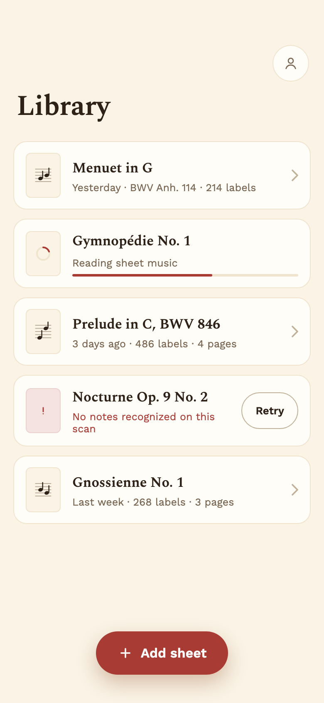
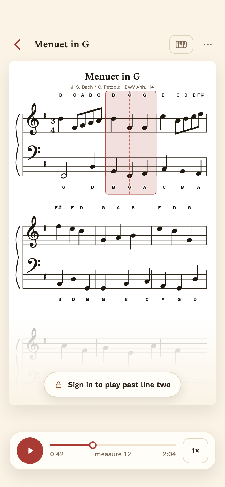
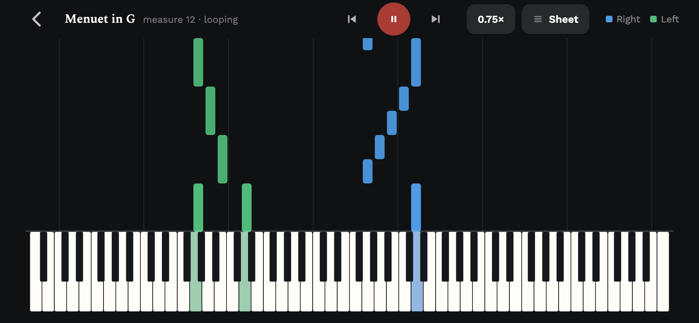
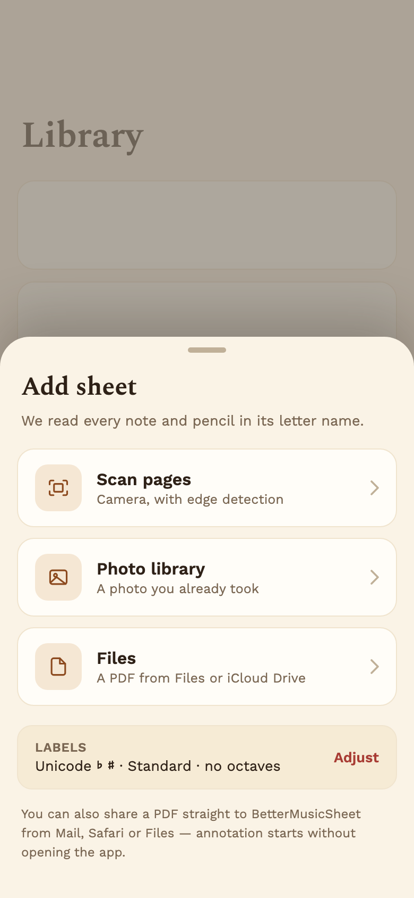
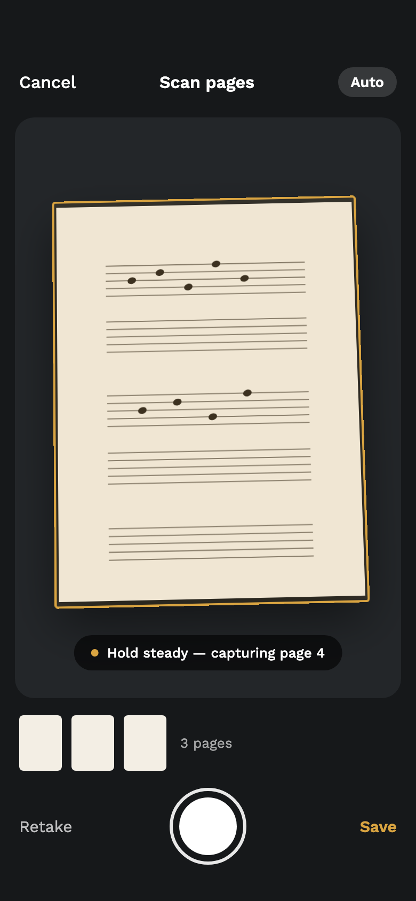
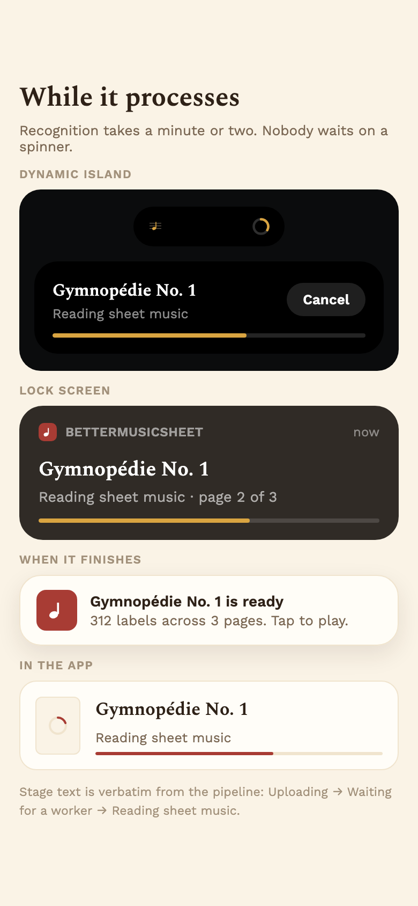
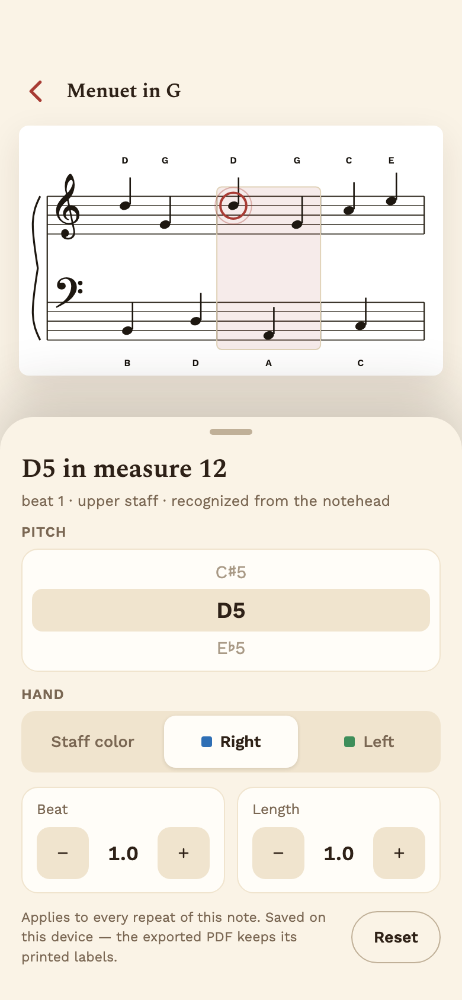

# BetterMusicSheet for iOS

Learning to read music is hard partly because a note's position on the staff
has to be converted into a pitch name in your head. This app does that
conversion and prints the answer right where you need it — then plays the
piece back with the keys lit up, so you can hear what you are reading.

A native iOS client for [BetterMusicSheet](https://bettermusicsheet.com). The
optical music recognition stays on the existing backend; this app is a REST
client plus native re-implementations of everything the web version did in the
browser — PDF rendering, audio scheduling, the keyboard and note roll, and the
correction store.

> **Early work in progress.** The screens below are the design artboards in
> [`design/`](design), rendered to images — not photographs of a finished app.
> The [status table](#status) says exactly what is implemented so far.

---

## Your library, not a job queue



The app opens on your music. Adding a sheet is one action in thumb reach, and
the empty state does the onboarding.

A sheet that is ready says nothing about its status — only the states that need
your attention speak up. One still being recognised shows its stage inline; one
that failed says why and offers to retry. A finished score just sits there
waiting to be played, which is what you came for.

<br clear="all" />

---

## Read a score with the names penciled in



Every notehead gets its letter name: above the staff for the right hand, below
for the left, with real accidentals — `B♭`, `C♯` — and the original engraving
left untouched.

Portrait is the reading mode: the page full width, pinch to zoom, one floating
transport. Tap any measure to play from there; hold it to loop it. The measure
sounding right now is outlined, and a dashed playhead steps from note to note.

A chord draws **one** playhead, not one per notehead — and where recognition
gave no notehead geometry, the position is interpolated across the bar and
marked as approximate rather than quietly faked.

Without an account you get the first two lines. The limit is shown *before*
you reach it, dimmed on the page, instead of interrupting you mid-phrase.

<br clear="all" />

---

## Practise with falling notes



Rotating the phone *is* the mode switch. 88 keys across a portrait phone would
be four points wide — unreadable — so the full keyboard lives in landscape,
where notes fall toward the key that will play them and arrive exactly as they
sound.

Blue is the right hand, green the left. The keyboard is drawn from real
instrument geometry: the twelve semitones are evenly spaced where they enter
the action, so F♯ sits noticeably left of its white-key boundary and A♯ to the
right. Centring the black keys is the single thing that makes a drawn keyboard
look wrong.

---

## Get music in the way it actually reaches you

<p>



</p>

Scan pages with the camera, pick a photo, open a PDF from Files — or share one
straight from Mail or Safari without opening the app at all.

Recognition takes a minute or two, so nothing asks you to sit and watch it. The
upload runs on a background session, a Live Activity carries the progress on the
Lock Screen and in the Dynamic Island, and a notification tells you when the
sheet is ready. Close the app; it still arrives.

---

## Fix what the recognition got wrong



Optical recognition is not perfect, and a wrong note is worse than no note. Tap
the offending notehead **on the sheet** and correct its pitch, hand, beat or
length.

A correction addresses the *printed* note, so every repeat of it changes at
once. Pitch fixes propagate through a tie chain, because a tie is one sounding
note and should not change pitch halfway through while it is still ringing.

Corrections are saved on the device and affect playback only — the exported PDF
keeps its generated labels.

<br clear="all" />

---

## Status

| Area | State |
|---|---|
| API client, identity, session | Implemented, tested |
| Tempo clock and tempo map | Implemented, tested |
| Corrections engine | Implemented, tested |
| Sheet geometry and playhead placement | Implemented, tested |
| Library screen | Implemented |
| Ingest (scan, files, photos, share) | Designed |
| Processing feedback, Live Activity | Designed |
| Read mode (PDFKit) | Designed |
| Practice mode (keyboard, note roll) | Designed |
| Audio engine | Designed |
| Sign-in | Designed |

65 tests across 9 suites currently pass.

---

## Design

This is a native redesign, not a translation of the web UI. The web app opens
on an upload form because a visitor arrives cold with a file in hand; an
installed app opens on your music instead. See
[docs/ios-app-plan.md](docs/ios-app-plan.md) for the reasoning and the phase
plan.

Two layers, two different rules:

- **Shared exactly** — the REST contract, the beat and tempo clock, note and
  measure geometry, corrections semantics, the free-tier rule. Re-deriving
  these produces bugs that only show up on a real score, so they are ported
  line for line from the web app and covered by tests.
- **Designed for iOS** — everything above that.

The paper-and-ink palette and the two hand colours are carried over from the
web app deliberately, so that someone using both sees one product.

---

## Building

Open `better_music_sheet_ios.xcodeproj` in Xcode 26 or later. The app targets
iOS 26.2 and builds in the Swift 6 language mode.

`AppConfig` points at the production API. To use a local `server.py`:

```swift
AppConfig.setAPIBaseOverride("http://localhost:8000")
```

Plain-HTTP localhost also needs an App Transport Security exception.

## Tests

```bash
swift test
```

`Package.swift` compiles the **same** source files as the app target — there is
no second copy — so the platform-independent layer can be tested natively on
macOS without a simulator. That matters more than it sounds: the simulator will
not run on every Mac (an older GPU aborts `SimMetalHost` and the screen stays
black), and this is where correctness actually lives.

Note that SwiftPM defaults to `nonisolated` while the app target compiles with
main-actor-by-default isolation, so a green `swift test` does not by itself
prove the app compiles. Build both.

## License

[GNU AGPL v3.0](LICENSE), inherited deliberately: the playback core here is
derived field-for-field from the AGPL-3.0 BetterMusicSheet project. Those terms
are in tension with App Store distribution, which is worth settling before
shipping a build.
